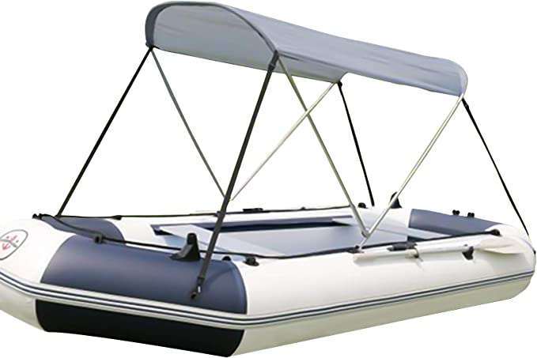

# Bimini

A [Bimini top](https://www.amazon.de/DYJD-wasserdichte-Baldachin-Fischerboot-Schlauchboot/dp/B0953HCKCR/ref=sr_1_7_mod_primary_new?crid=3UIRBXU0F6MFQ&keywords=schlauchboot+sonnenschutz&qid=1683283629&sbo=RZvfv%2F%2FHxDF%2BO5021pAnSA%3D%3D&sprefix=schlauchboot+so%2Caps%2C89&sr=8-7) is an open-front canvas top for the cockpit of a boat, usually supported by a metal frame. Most Biminis can be collapsed when not in use, and raised again if shade or shelter from rain is desired.

Bimini tops differ from dodgers in that dodgers include protection in front and on the sides, while a Bimini does not. The Bimini is used mostly as protection from the sun; it offers no protection from wind, rain, or spray when moving forward at any speed. The top provides rain protection only if the boat is stationary and there is no wind. It can also be personalized to fit different types of boats and can come in different colours.