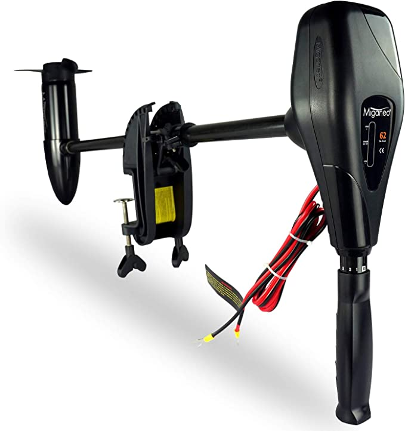

# {{ $frontmatter.title }}

With inflatable boat motors, you can enjoy more on boating than paddling!

For the best boating experiences, the motors for inflatable boats should be easy to maneuver and install, with light weight, decent speed and lifespan.

But many of you might be clueless on inflatable boat motors and no idea where to start.

This post will serve as a simple guide to help you select the best outboard motor for inflatable boat.

This guide is suitable for those who are new to inflatable boat motors and want to have a complete understanding, and those who looking for reliable motors for inflatables.