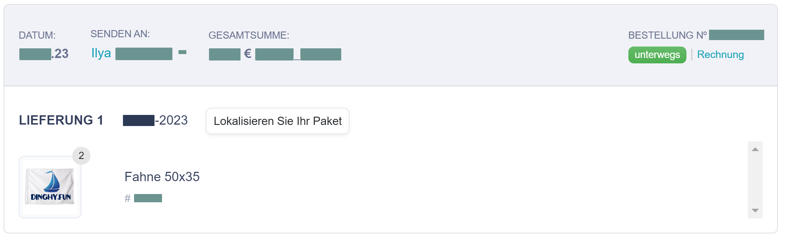

# My own flag

How should one start the first dinghy sailing? Buy a new boat? Read books about this topic? Go to a yacht club to get some training? Not at all.

The first thing to prepare is to buy a flag. I've ordered one even without getting a confirmation that my DinghyGo is on its way.

{data-zoomable}