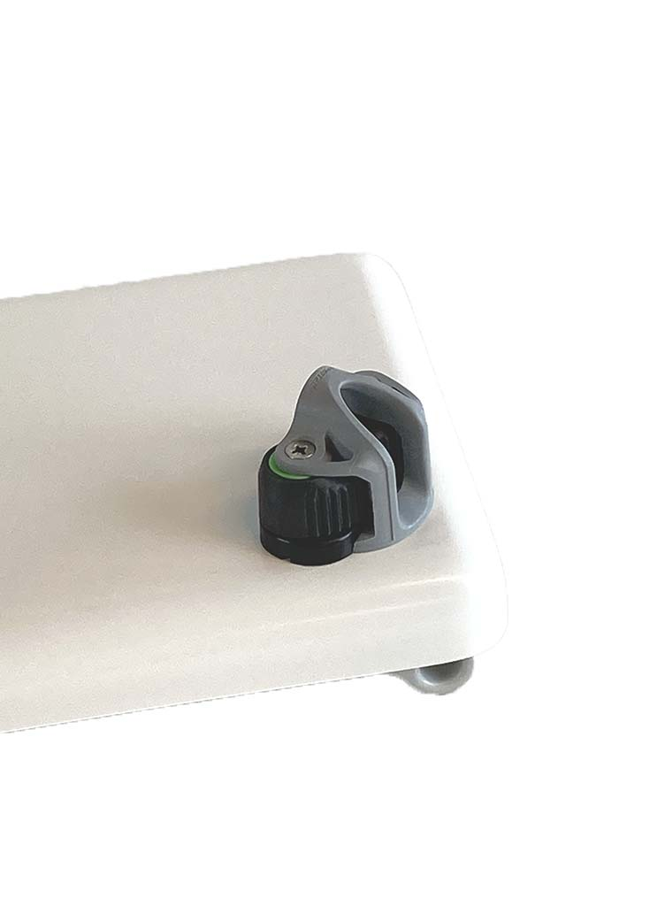
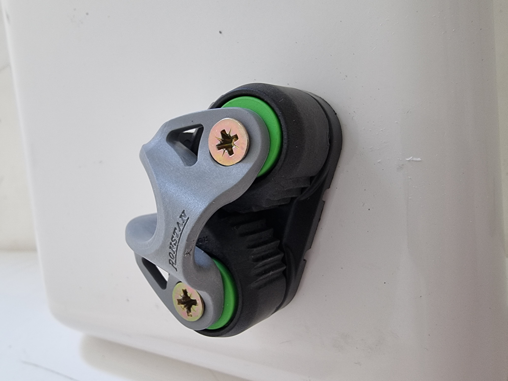
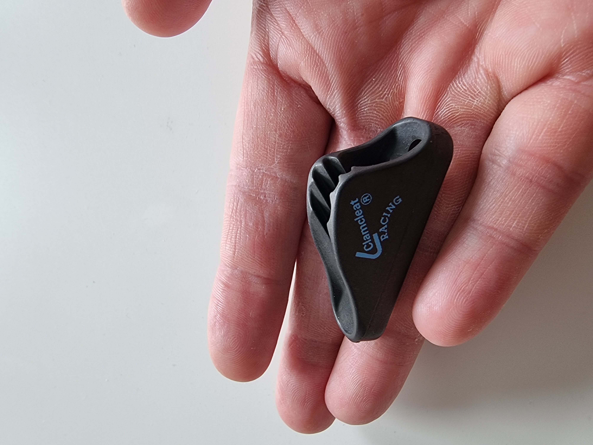

# Jibcleat

{data-zoomable}

Set swivelling [jibcleats](https://dinghygo-support.de/product/set-swiveling-jibcleats-with-fairlead-only-orca-375/?v=3a52f3c22ed6) for mounting on the (mast)thwart of the DG Orca 375.

I want to steer single-handed. So I don't want to hold jib ropes anymore.

{data-zoomable}

{data-zoomable}

I have installed mast cleat as well to drop the sail if necessary right from the cockpit:

{data-zoomable}

