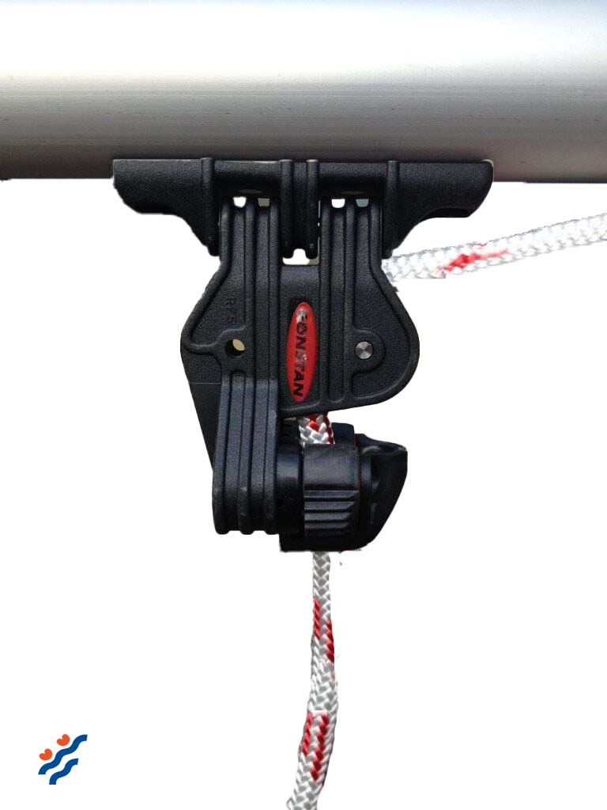

# Mainsheet Cleat

This Ronstan [mainsheet cleat](https://dinghygo-support.de/product/mainsheet-cleat/?v=3a52f3c22ed6) is, as usual on high-performance dinghies nowadays like the Olympic 49er attached to the boom.

The cleat swivels in order to get the correct sheet angle under all circumstances and makes for an easy release.