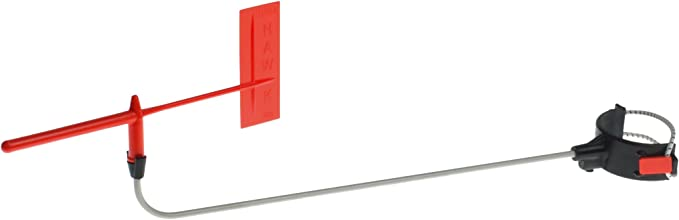

# Wind Indicator

The [Little Hawk Mk2](https://www.amazon.de/Hawk-Little-2-Podium/dp/B01NAZ6C6L/ref=sr_1_8?keywords=Hawk+Marine+Products&qid=1684237390&sr=8-8) brings all the benefits of the Little Hawk Mk1 Wind Indicator and mounts it in a secure manor at gooseneck height in front of the mast. Designed for smaller single handed Dinghies, the Little Hawk Mk2 allows quick and accurate reference to wind direction without having to look at the top of the mast. Ideal for upwind and downwind reference. The Little Hawk Mk2 is easily mounted and removed with a secure adjustable bracket. The aluminium support rod can be bent to any required angle, but is easily straightened if accidentally knocked. The complete unit removes for safe storage without any tools. The Little Hawk Mk2 is very popular with Topper and Laser Sailors.

