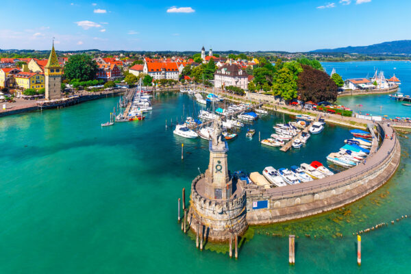

# {{ $frontmatter.title }}

Bodensee, also known as Lake Constance, is a popular destination for sailing enthusiasts. The lake is located in central Europe, bordered by Germany, Switzerland, and Austria. Bodensee is the third-largest lake in Europe, with a surface area of 536 square kilometers. The lake offers a variety of sailing experiences, including recreational sailing, racing, and cruising. The lake's winds can vary greatly depending on the time of day and weather conditions. The most popular sailing season on Bodensee is from April to October, with the warmest temperatures in July and August. The lake has several marinas and harbors, offering amenities such as fuel, water, electricity, and restaurants. Sailing schools and charter companies are available for those looking to learn how to sail or rent a boat. The lake's clear waters and stunning scenery make it a unique and enjoyable sailing destination. Sailing at Bodensee provides the opportunity to explore the lake's various ports and towns, including Konstanz, Friedrichshafen, and Bregenz.