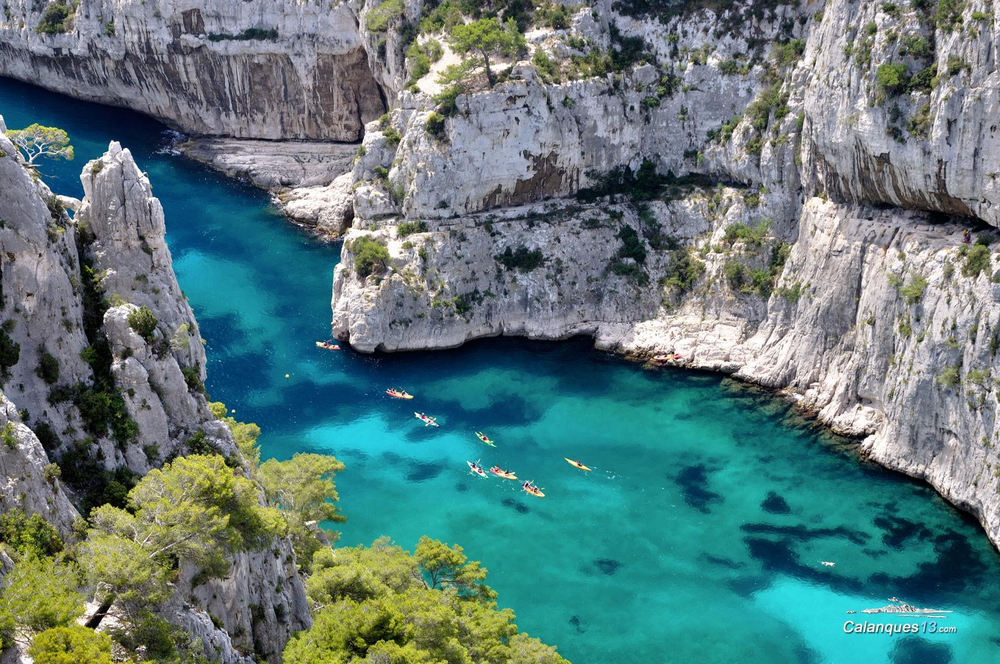

# Calanques

Calanques is a stunning coastal area located near Marseille, France, known for its rocky cliffs and clear turquoise waters. Sailing in Calanques provides the opportunity to explore its rugged coastline and secluded bays. The area has several ports and marinas, including the Vieux Port de Marseille and the Port de Cassis. Calanques is a popular destination for both recreational and competitive sailing, with numerous sailing races held in the area. The winds in Calanques can be unpredictable, so it's important for sailors to be familiar with the area and its weather patterns. The waters around Calanques are home to a diverse range of marine life, including dolphins, whales, and sea turtles. Sailing in Calanques requires a permit, which can be obtained from the National Park authorities. The area has several sailing schools and charter companies, offering lessons and boat rentals for those looking to learn how to sail or explore the area on their own. The cliffs and rocky terrain of Calanques offer a unique and breathtaking backdrop for sailing and other water activities. Sailing near Calanques is a must-do activity for anyone visiting the area, providing an unforgettable experience and a chance to explore some of the most beautiful coastline in the world.