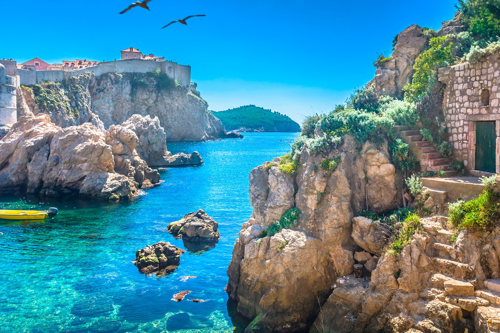

# Croatia

Croatia is a popular sailing destination, known for its crystal-clear waters, stunning coastlines, and picturesque islands. The country has over a thousand islands, making it a paradise for sailing enthusiasts.
The sailing season in Croatia typically runs from April to October, with the warmest months being July and August. Croatia has several marinas and ports, offering a range of amenities including fuel, water, electricity, and restaurants. The country has a well-developed sailing infrastructure, with numerous sailing schools, yacht charters, and sailing events held throughout the year. The winds in Croatia are generally predictable, with the Maestral wind being the most common, making it a great destination for both beginner and experienced sailors. The country's coastline offers a range of sailing experiences, from exploring quiet bays and coves to navigating open waters and visiting bustling port cities. The waters around Croatia are home to a variety of marine life, including dolphins, sea turtles, and colorful fish. Sailing in Croatia provides the opportunity to explore historic towns and cultural sites, such as Dubrovnik, Split, and Hvar. Croatia's stunning natural beauty and diverse sailing experiences make it a must-visit destination for anyone passionate about sailing and the sea.