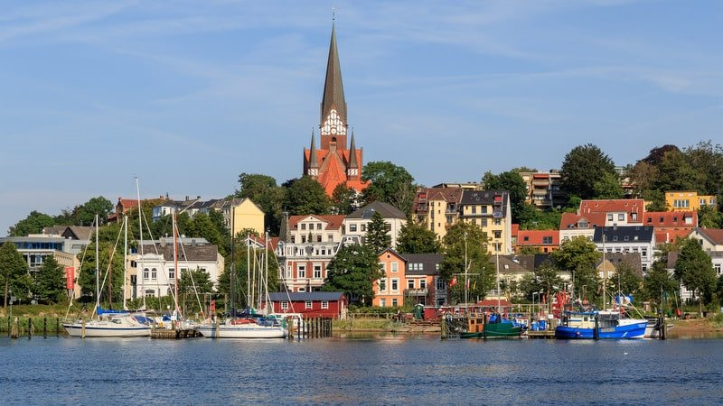

# {{ $frontmatter.title }}

Flensburg is a city in northern Germany, located near the Danish border, and is a popular destination for sailing enthusiasts. The city has a large natural harbor and several marinas, offering a range of amenities for boaters and sailors. Sailing near Flensburg provides the opportunity to explore the picturesque Baltic Sea and its stunning coastline. The region has several sailing schools and yacht charters, offering lessons and boat rentals for both beginners and experienced sailors. Flensburg is known for its regattas and sailing events, such as the Flensburg Fjord Regatta, which attracts sailors from all over the world. The weather in the region can be unpredictable, with winds varying from calm to strong depending on the time of year and weather conditions. The area around Flensburg is home to several islands, such as the Danish island of Als and the German island of Sylt, offering unique sailing experiences. The waters around Flensburg are home to a variety of marine life, including porpoises, seals, and seabirds. Sailing in Flensburg provides the opportunity to explore the city's historic port and cultural sites, such as the Maritime Museum and the Naval Academy. The natural beauty of the Baltic Sea, combined with Flensburg's sailing culture and amenities, make it a must-visit destination for anyone passionate about sailing and the sea.