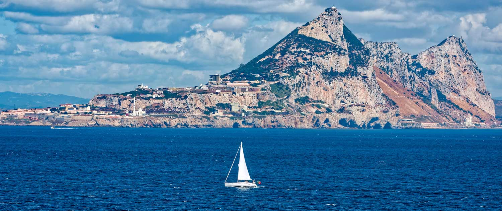

# Gibraltar

Gibraltar is a British Overseas Territory located at the southern tip of Spain and is known for its strategic location at the entrance to the Mediterranean Sea. The narrow strait of Gibraltar separates Europe and Africa, making it a popular destination for sailors looking to cross between the two continents. Sailing in the strait of Gibraltar provides the opportunity to enjoy stunning views of the rugged coastlines of Spain and Morocco. The strait is known for its strong currents and variable winds, making it a challenging but rewarding destination for experienced sailors. Gibraltar has a well-developed sailing infrastructure, with several marinas and yacht clubs offering a range of amenities for boaters and sailors. The region is home to several sailing schools and yacht charters, allowing visitors to rent boats and explore the waters of the strait. Sailing between Europe and Africa in Gibraltar provides the opportunity to visit nearby attractions such as the historic city of Tangier in Morocco or the scenic town of Tarifa in Spain. The strait is also home to several species of whales and dolphins, providing the opportunity for wildlife sightings while sailing.
The region has a rich history and culture, with Gibraltar itself home to several historic landmarks and museums. The combination of challenging sailing conditions, stunning scenery, and rich cultural offerings make sailing between Europe and Africa in Gibraltar a must-visit destination for any adventurous sailor.