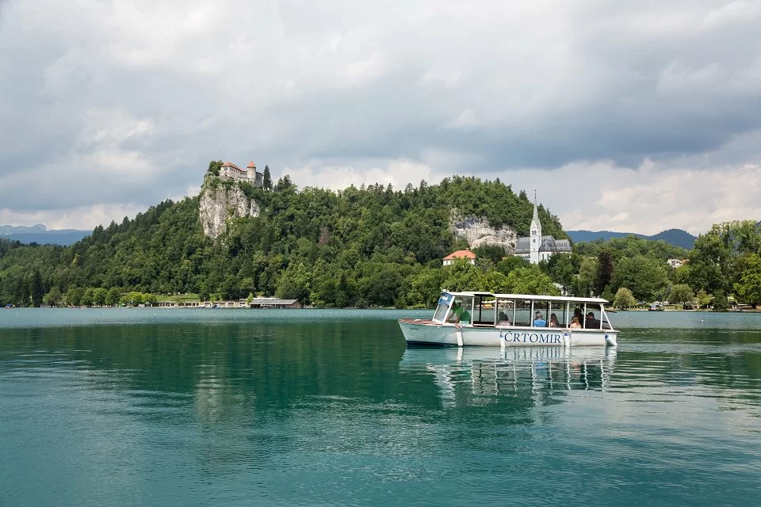

# {{ $frontmatter.title }}

Lake Bled is a beautiful alpine lake located in the Julian Alps of Slovenia, and is a popular destination for sailing enthusiasts. With a surface area of around 2.1 square kilometers, Lake Bled is a clear blue-green lake surrounded by stunning mountain scenery. The lake is home to several marinas, including the Sailing Club Bled, offering a range of amenities for boaters and sailors. Sailing on Lake Bled provides the opportunity to enjoy stunning views of the surrounding mountains, the castle perched on the cliff, and the beautiful island with a church in the middle of the lake. The lake offers calm and peaceful sailing conditions, making it an ideal destination for beginners, families, and romantic cruises. Lake Bled is also popular for rowing, paddleboarding, and swimming in its clear waters. The region has a well-developed sailing infrastructure, with several sailing schools and yacht charters available for visitors. Sailing on Lake Bled provides the opportunity to visit nearby attractions such as the Vintgar Gorge, the Triglav National Park, and the medieval town of Radovljica. The lake is surrounded by hiking and cycling trails, allowing visitors to explore the breathtaking alpine scenery. The combination of beautiful scenery, calm sailing conditions, and rich cultural offerings make Lake Bled a must-visit destination for anyone passionate about sailing and the outdoors.