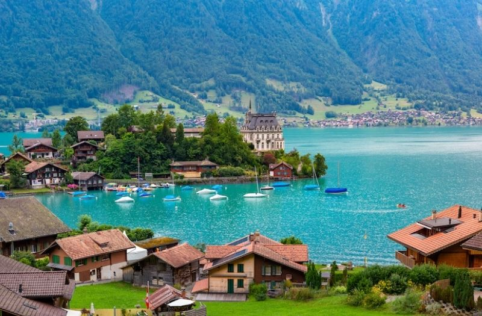

# {{ $frontmatter.title }}

Lake Brienz is a beautiful alpine lake located in the Bernese Oberland region of Switzerland and is a popular destination for sailing enthusiasts. With a surface area of around 29 square kilometers, Lake Brienz is a clear blue lake surrounded by stunning mountain scenery. The lake is home to several marinas, including those in the town of Brienz, offering a range of amenities for boaters and sailors. Sailing on Lake Brienz provides the opportunity to enjoy stunning views of the surrounding mountains and the picturesque towns and villages along the lake's shores. The lake offers a variety of sailing conditions, from gentle breezes to stronger winds, making it an ideal destination for both beginner and experienced sailors. Lake Brienz is a popular location for regattas and sailing competitions, attracting sailors from all over the world. The lake is also home to several waterfalls, including the impressive Giessbach Falls, which can be viewed from the lake. The region has a well-developed sailing infrastructure, with several sailing schools and yacht charters available for visitors. Sailing on Lake Brienz provides the opportunity to visit nearby attractions such as the town of Interlaken, the Aare Gorge, and the Jungfraujoch. The combination of beautiful scenery, varied sailing conditions, and rich cultural offerings make Lake Brienz a must-visit destination for anyone passionate about sailing and the outdoors.