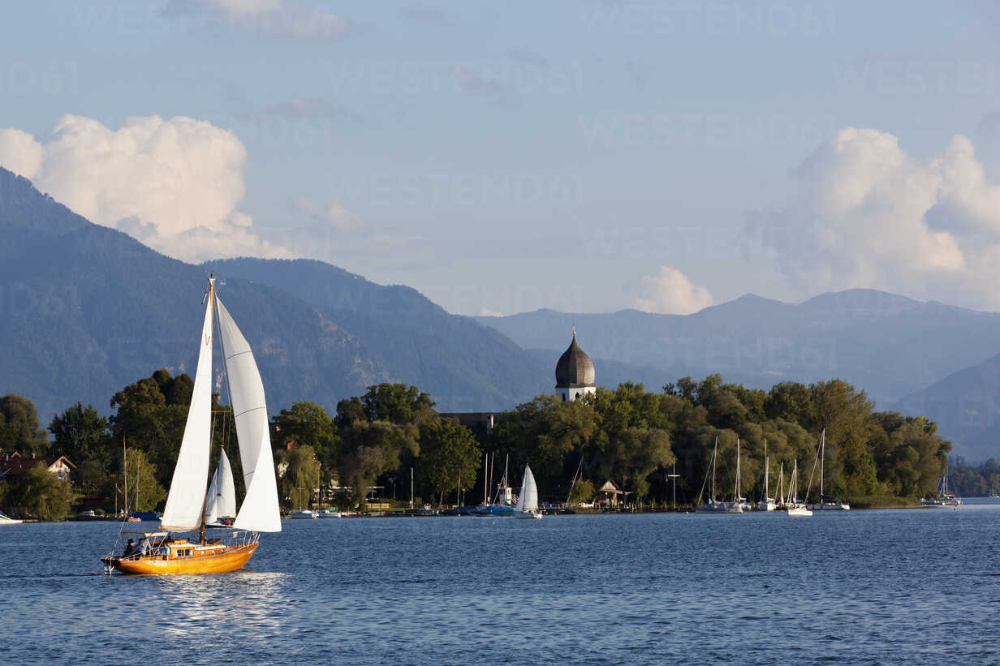

# Lake Chiemsee

Lake Chiemsee, also known as the Bavarian Sea, is the largest lake in Bavaria, Germany, and a popular destination for sailing enthusiasts. With a surface area of around 80 square kilometers, Lake Chiemsee is a beautiful freshwater lake surrounded by stunning alpine scenery. The lake is home to several marinas and yacht clubs, including those in the towns of Prien and Gstadt, offering a range of amenities for boaters and sailors. Sailing on Lake Chiemsee provides the opportunity to enjoy stunning views of the surrounding mountains and the picturesque towns and villages along the lake's shores. The lake offers a variety of sailing conditions, from gentle breezes to stronger winds, making it an ideal destination for both beginner and experienced sailors. Lake Chiemsee is a popular location for regattas and sailing competitions, attracting sailors from all over the world. The lake is also home to several islands, including Herrenchiemsee and Frauenchiemsee, which can be visited by boat. The region has a well-developed sailing infrastructure, with several sailing schools and yacht charters available for visitors. Sailing on Lake Chiemsee provides the opportunity to visit nearby attractions such as the Chiemgau Alps, the town of Salzburg, and the Bavarian Forest National Park. The combination of beautiful scenery, varied sailing conditions, and rich cultural offerings make Lake Chiemsee a must-visit destination for anyone passionate about sailing and the outdoors.