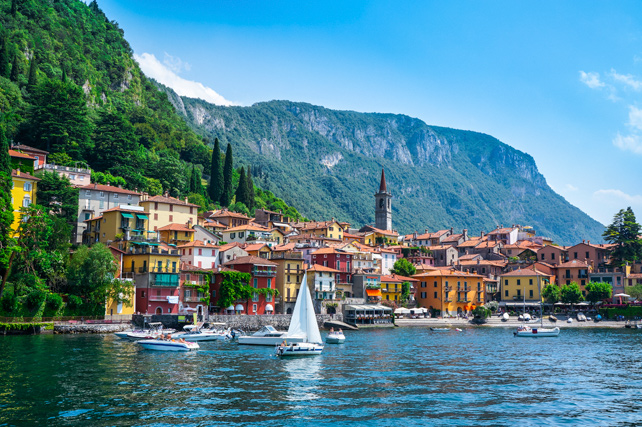

# {{ $frontmatter.title }}

Lake Como, also known as Lago di Como, is a beautiful lake located in the Lombardy region of Italy and is a popular destination for sailing enthusiasts. With a surface area of around 146 square kilometers, Lake Como is one of the largest lakes in Italy and is surrounded by stunning mountain scenery. The lake is home to several marinas, including those in the towns of Como, Lecco, and Bellagio, offering a range of amenities for boaters and sailors. Sailing on Lake Como provides the opportunity to enjoy stunning views of the surrounding Alps and the picturesque towns and villas along the lake's shores. The lake offers a variety of sailing conditions, from gentle breezes to stronger winds, making it an ideal destination for both beginner and experienced sailors. Lake Como is a popular location for regattas and sailing competitions, attracting sailors from all over the world. The lake is also home to several historic villas and gardens, such as the Villa Carlotta, which can be visited by boat. The region has a well-developed sailing infrastructure, with several sailing schools and yacht charters available for visitors.
Sailing on Lake Como provides the opportunity to visit nearby attractions such as the town of Bellagio, the Como Cathedral, and the scenic funicular ride to Brunate. The combination of beautiful scenery, varied sailing conditions, and rich cultural offerings make Lake Como a must-visit destination for anyone passionate about sailing and the outdoors.