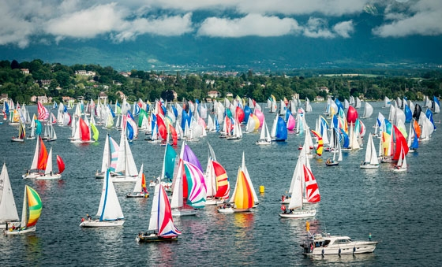

# Lake Geneve

Lake Geneva, also known as Lac Léman, is a beautiful freshwater lake located in Western Europe, bordered by France to the south and Switzerland to the north. With a surface area of around 580 square kilometers, Lake Geneva is one of the largest lakes in Western Europe and a popular destination for sailing enthusiasts. The lake offers a variety of sailing conditions, from gentle breezes to stronger winds, making it an ideal destination for both beginner and experienced sailors. The region has several ports and marinas, including the major cities of Geneva and Lausanne, offering a range of amenities for boaters and sailors. Sailing on Lake Geneva provides the opportunity to enjoy stunning views of the surrounding Alps and the picturesque towns and villages along the lake's shores. Lake Geneva is also a popular location for regattas and sailing competitions, attracting sailors from all over the world. The lake is home to a variety of fish, including perch, trout, and pike, making it a great location for fishing enthusiasts. The region has a well-developed sailing infrastructure, with several sailing schools and yacht charters available for visitors. Sailing on Lake Geneva provides the opportunity to visit nearby attractions such as the Chillon Castle, the UNESCO-listed Lavaux Vineyards, and the Montreux Jazz Festival. The combination of beautiful scenery, varied sailing conditions, and rich cultural offerings make Lake Geneva a must-visit destination for anyone passionate about sailing and the outdoors.