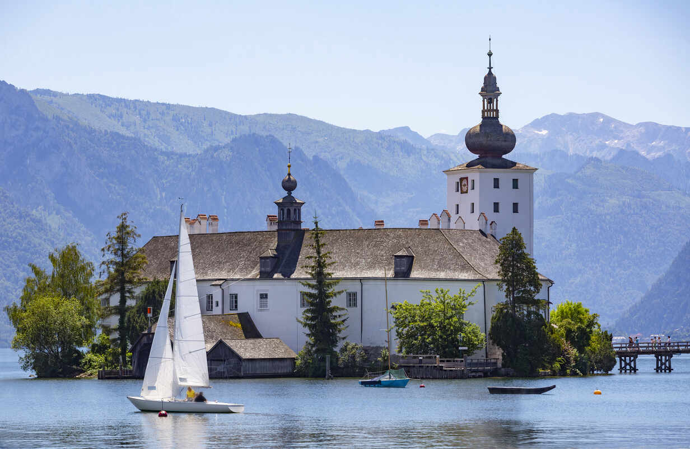

# Lake Trauensee

Traunsee is a picturesque lake located in Austria, in the Salzkammergut region. The lake is a popular destination for sailing enthusiasts, offering stunning views of the surrounding mountains and crystal-clear waters. Traunsee has several marinas and ports, offering a range of amenities for boaters and sailors. The region has a well-developed sailing infrastructure, with numerous sailing schools, yacht charters, and sailing events held throughout the year. The winds in Traunsee are generally predictable, making it an ideal destination for both beginner and experienced sailors. The waters around Traunsee are home to a variety of freshwater fish, including trout and pike, making it a great location for fishing enthusiasts. Sailing in Traunsee provides the opportunity to explore historic towns and cultural sites, such as the castle of Schloss Ort and the town of Gmunden. The coastline of Traunsee offers a range of sailing experiences, from exploring quiet bays and coves to navigating open waters and visiting bustling port cities. The region's stunning natural beauty, combined with its rich history and culture, make it a must-visit destination for anyone passionate about sailing and the outdoors. Traunsee's calm waters, scenic surroundings, and range of activities make it a perfect destination for a sailing holiday in Austria.