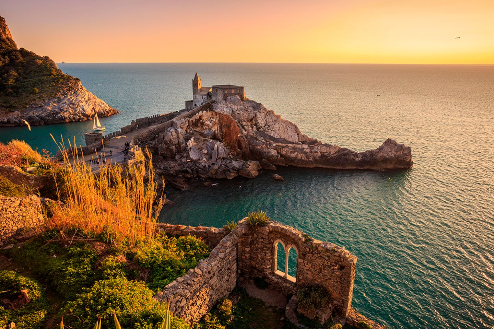

# {{ $frontmatter.title }}

Portovenere is a picturesque Italian village located on the Ligurian coast, near the famous Cinque Terre. The village is a popular destination for sailing enthusiasts, offering stunning views of the Ligurian Sea and the surrounding landscape. The region has several marinas and ports, offering a range of amenities for boaters and sailors. Sailing near Portovenere provides the opportunity to explore the stunning coastline and the nearby islands of Palmaria, Tino, and Tinetto. The region has a well-developed sailing infrastructure, with numerous sailing schools, yacht charters, and sailing events held throughout the year. The waters around Portovenere are home to a variety of marine life, including dolphins, whales, and sea turtles. Sailing in Portovenere provides the opportunity to explore historic towns and cultural sites, such as the nearby Cinque Terre and the town of La Spezia. The coastline of Portovenere offers a range of sailing experiences, from exploring quiet bays and coves to navigating open waters and visiting bustling port cities. The region's stunning natural beauty, combined with its rich history and culture, make it a must-visit destination for anyone passionate about sailing and the sea. Portovenere's warm climate, clear waters, and diverse sailing experiences make it a perfect destination for a sailing holiday in Italy.