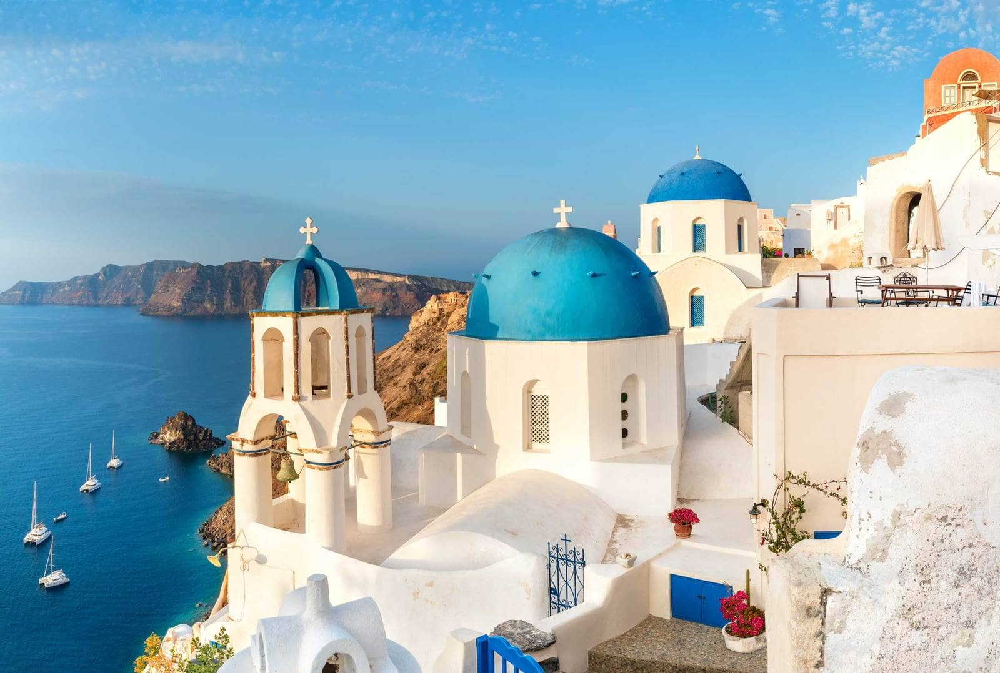

# Santorini

Santorini is a Greek island located in the Aegean Sea and is a popular destination for sailing enthusiasts. The island is surrounded by the crystal-clear waters of the Aegean Sea, offering stunning views of the island from the water. Sailing near Santorini provides the opportunity to explore the volcanic cliffs and beaches, and the picturesque villages perched on top of them. The region has several marinas and ports, offering a range of amenities for boaters and sailors. The weather in Santorini is generally sunny and dry, with predictable winds during the summer months, making it an ideal destination for sailing holidays. The waters around Santorini are home to a variety of marine life, including octopuses, sea turtles, and schools of colorful fish. Sailing in Santorini provides the opportunity to explore other nearby islands, such as Ios, Anafi, and Amorgos, offering unique sailing experiences. The region has several sailing schools and yacht charters, offering lessons and boat rentals for both beginners and experienced sailors. Santorini is known for its spectacular sunsets, which can be enjoyed from the deck of a sailing boat, creating a magical and unforgettable experience. The natural beauty of Santorini, combined with its sailing culture and amenities, make it a must-visit destination for anyone passionate about sailing and the sea.