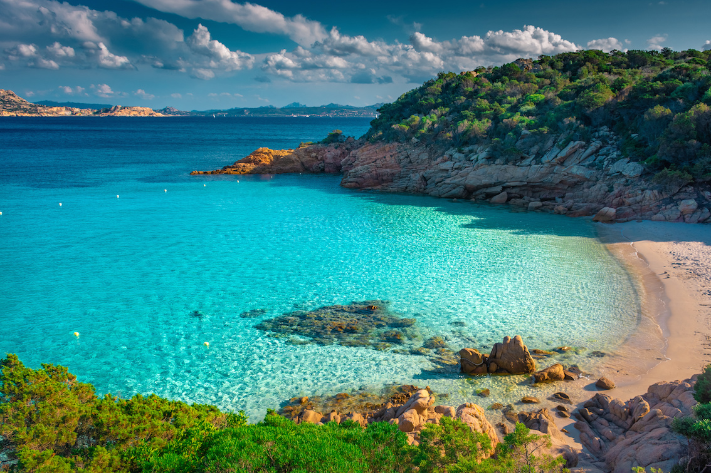

# {{ $frontmatter.title }}

North Sardinia is a popular sailing destination, known for its crystal-clear waters, stunning coastline, and picturesque islands.
The region has several marinas and ports, offering a range of amenities for boaters and sailors. Sailing in North Sardinia provides the opportunity to explore the Maddalena Archipelago, one of the most beautiful and protected areas of the Mediterranean. The region has a well-developed sailing infrastructure, with numerous sailing schools, yacht charters, and sailing events held throughout the year. The winds in North Sardinia are generally predictable, with the Maestrale and the Mistral being the most common, making it a great destination for both beginner and experienced sailors. The waters around North Sardinia are home to a variety of marine life, including dolphins, sea turtles, and colorful fish. Sailing in North Sardinia provides the opportunity to explore historic towns and cultural sites, such as Olbia, Alghero, and the ancient city of Tharros. The coastline of North Sardinia offers a range of sailing experiences, from exploring quiet bays and coves to navigating open waters and visiting bustling port cities. The region's stunning natural beauty, combined with its rich history and culture, make it a must-visit destination for anyone passionate about sailing and the sea. North Sardinia's warm climate, clear waters, and diverse sailing experiences make it a perfect destination for a sailing holiday in the Mediterranean.