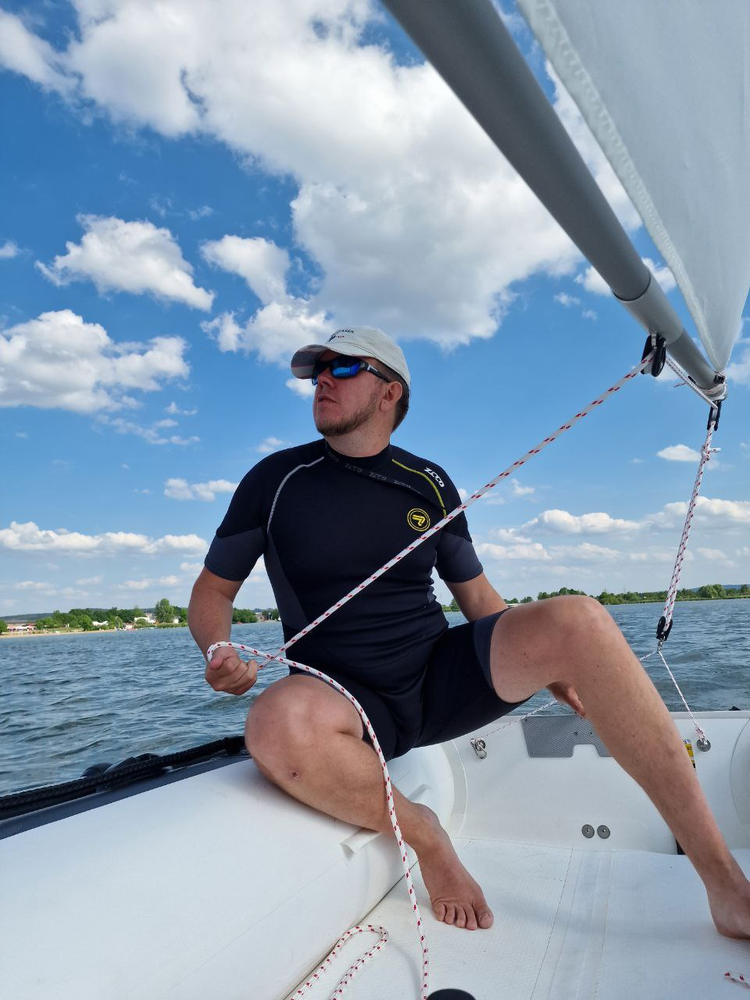
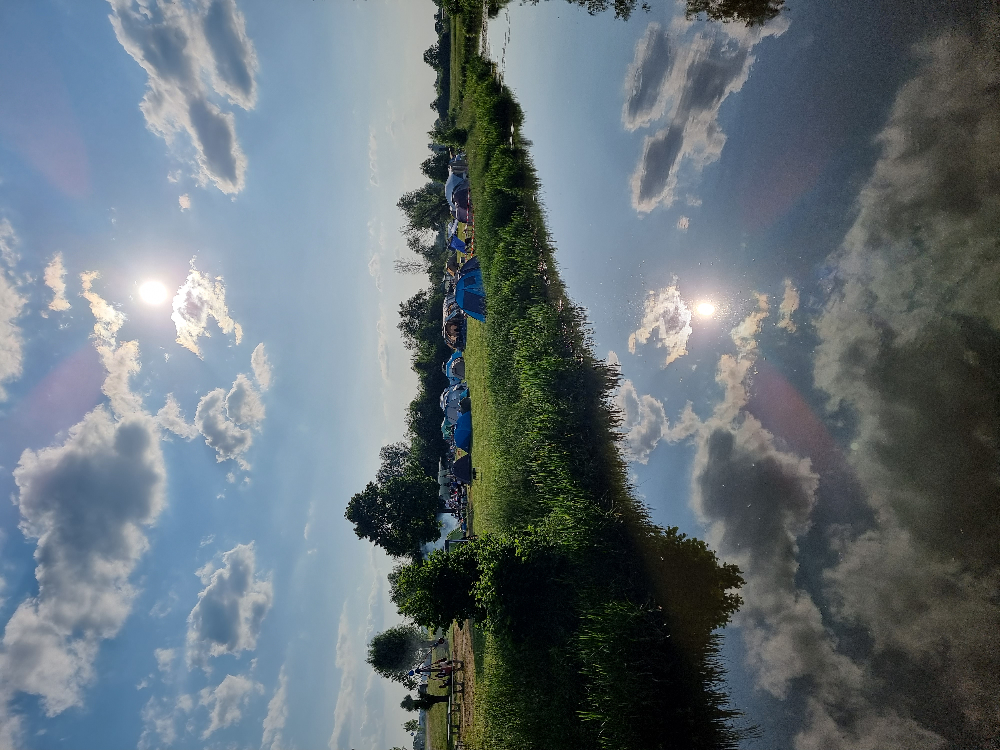
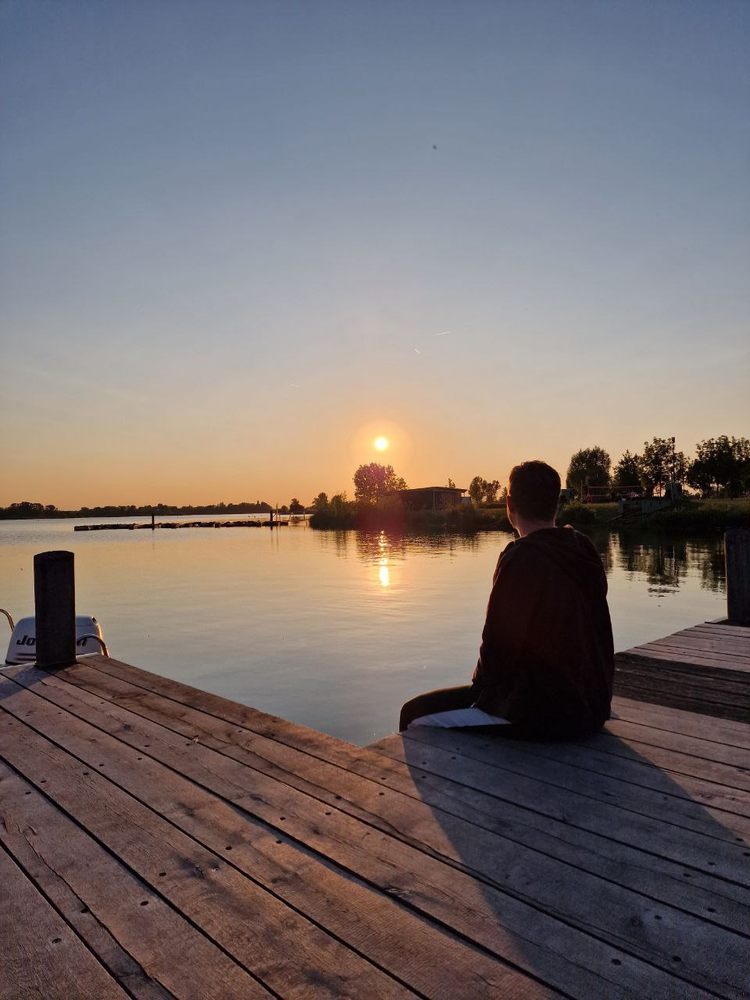
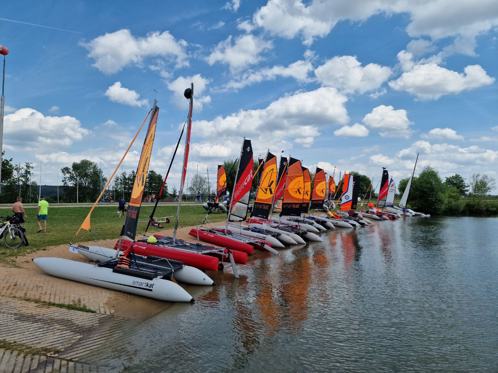

# First Trip on Altmühlsee Lake

{data-zoomable}

It was my first trip with the newest DinghyGo Orca 375. The idea was to visit [inflatable boats meeting in Germany](https://www.atsc1970.de/schlauchkattreffen/) and maybe even participate in some racings. But as soon as I had no experience with sailing dinghies before I left this idea for the next time.

We have arrived to the tent camp on Altmühlsee lake (Germany) on Friday evening.

{data-zoomable}

Setting the tent and cooking something to eat took all our energy and we left the idea to inflate the boat. Moreover it was getting dark already.

{data-zoomable}

On the next day we assembled the boat for the first time. I suggested it would take approximately 30 minutes. But without any experience we had around 90 minutes to make the boat ready for the start. For example, a lot of time was spent on inflating/deflating because of some parts could be only set with half-inflated boat. I think I will make a video about it later.

{data-zoomable}

We finally managed to start without a jib. It was really easy and made a lot of fun. Soon we set the jib and enjoyed the whole day.

Other inflatables were catamarans. And they all were faster than us (even ones with the same sails square). So if you really need much speed - consider buying a catamaran. I knew about it and maybe I will prepare another post comparing DinghyGo and a catamaran from my point of view (why I bought the dinghy).

{data-zoomable}

Check this [video](https://www.youtube.com/shorts/qB9ZBHRsPL0) on my Youtube Channel.

{data-zoomable}

