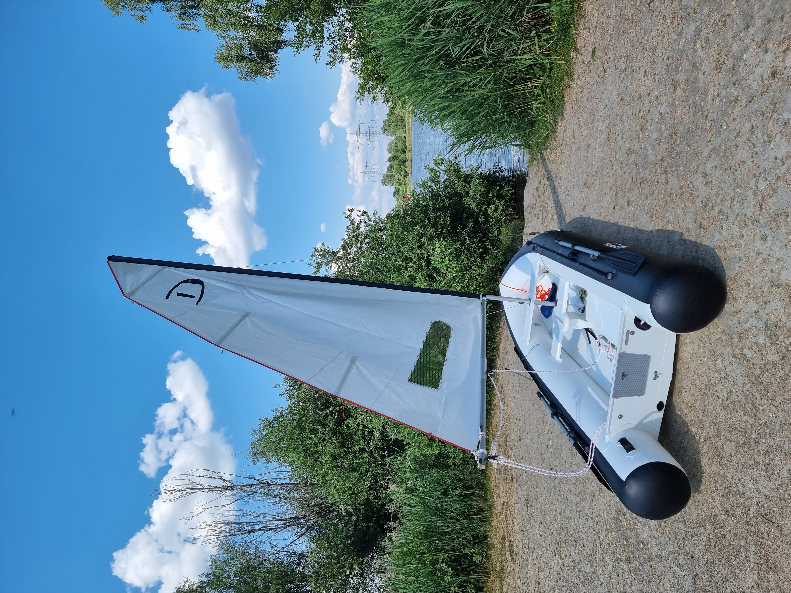
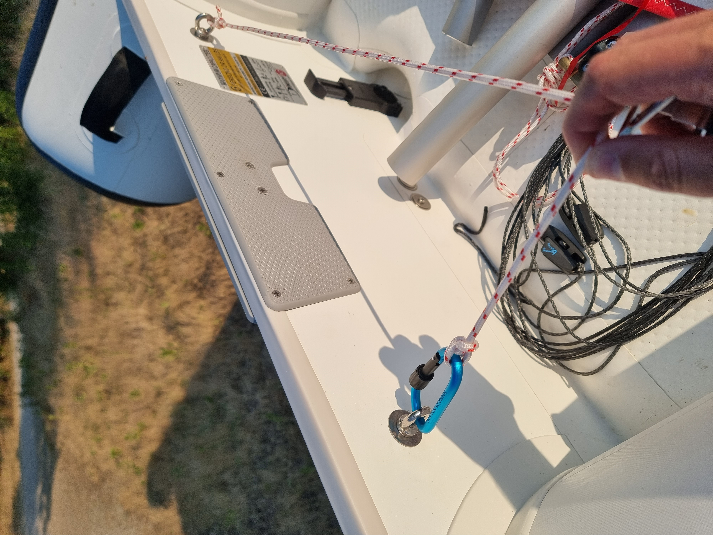
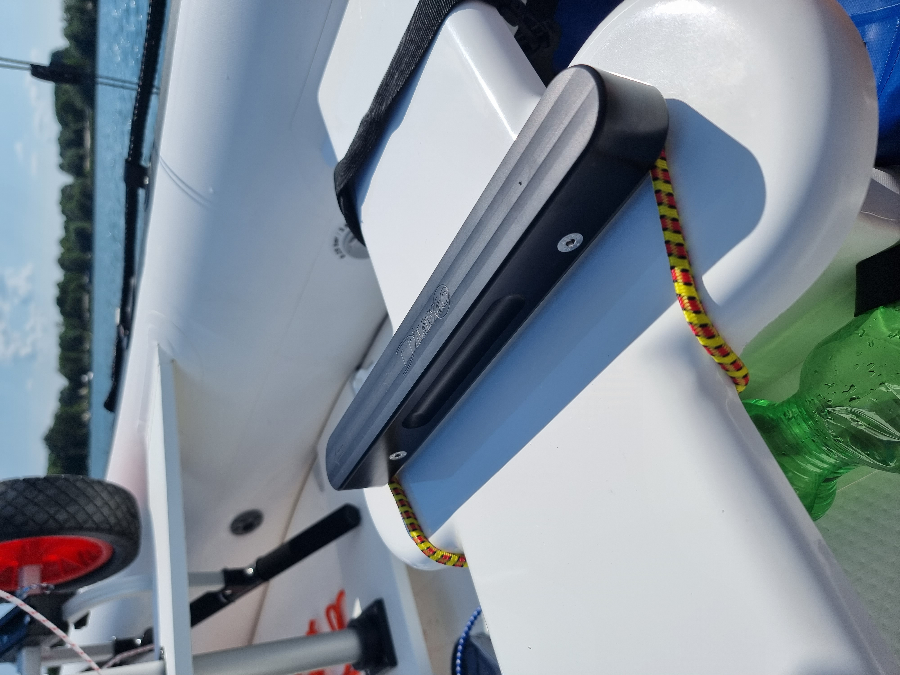
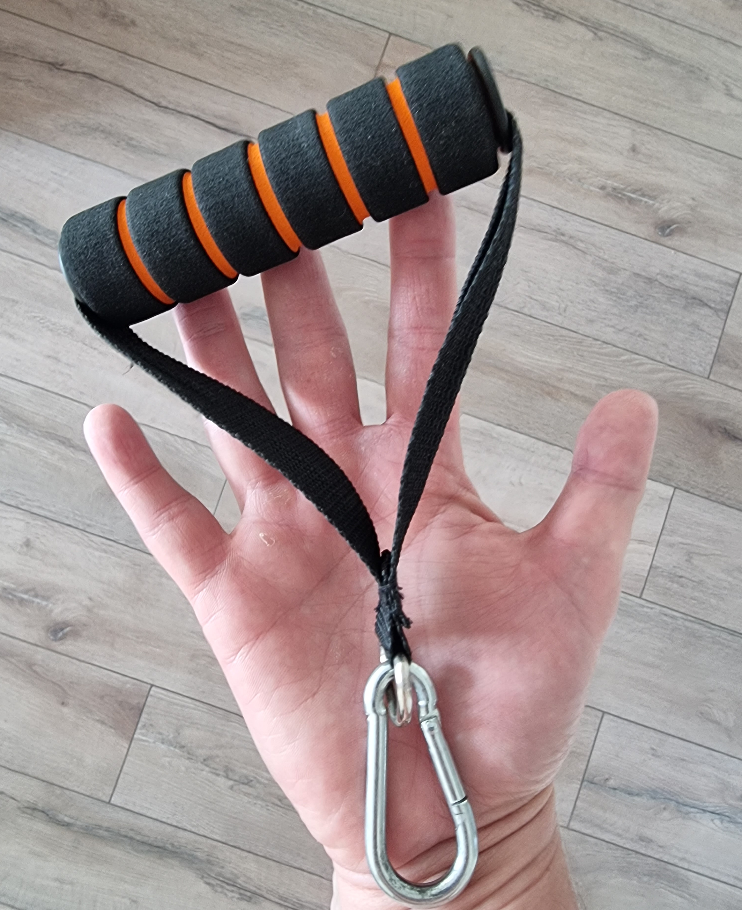

# Erlichsee Lake on 9 June 2023

Erlichsee is a small lake in my neighbourhood. This time I was alone and wanted to check how long it takes to assemble the boat single-handed. I have purchased an electric [pump](../boat/pump.md) before, so I could set the sail while the boat was being inflated. And it took like 50 minutes to get everything ready (without the jib).

{data-zoomable}

The wind speed was around 7 knotes so I could really train how to control the boat without any pressure.

{data-zoomable}

And I could find out several things to improve. First of all a traveller line was advised to be set with a carabiner in [one](https://youtu.be/gg9_5FmfOgU?t=149) of the DinghyGo videos. 

{data-zoomable}

This carabiner stucks sometimes during the boat control which doesn't lead to any problem but looks ugly and messy. So I would advise to have this line always on the boat fixed with the pile stitch on both ends.

The second issue is related to the duggerboard. To control it you need to have some resistance - otherwise it's always in the lowest position. So I just used a rubber line bought some long time ago. It fits perfect.

{data-zoomable}
{data-zoomable}

So the sailing alone makes a lot of fun. Unfortunately I still have no any cleats for the jib, so I can only have one sail set.

After some hours I landed on a small beach in 350 from my car. So I had to get my boat out of the water and move it for a long distance. And the [wheels](../boat/wheels.md) which I had on-board are really handy for that. So I'm happy with this purchase.

{data-zoomable}

The only thing which is made really strange in this boat is the handle in the bow. It's positioned too low and your hand really needs to be bended while you are transporting the dinghy. It hurts.

{data-zoomable}

Next trips I used the part of my fitness exercise set to move the boat and it fits much nicer:

{data-zoomable}

You can also check the [video](https://www.youtube.com/shorts/6D3QUy0cmJg) on my Youtube Channel to see the beautiful scenery on that day.